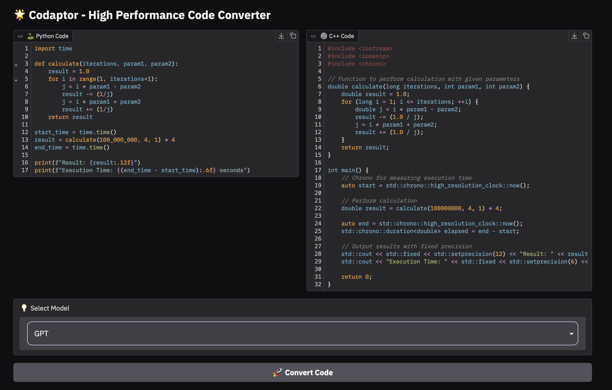

# ⚡ Codaptor

**Codaptor** is an AI-powered code transpiler that converts Python code into high-performance C++ using advanced LLMs like GPT-4, Claude, and CodeQwen. Designed with performance, portability, and clarity in mind, Codaptor brings intelligent language transformation to your fingertips.

> 🔁 The name *Codaptor* merges “Code” and “Adaptor” — a system that intelligently adapts one language to another for optimized execution.

---

## ✨ Features

### 🤖 LLM-Powered Transpilation
- Seamless code transformation using:
  - GPT-4
  - Claude
  - CodeQwen (via HuggingFace endpoints)

### ⚙️ Multi-Model Support
- Switch between open-source and proprietary models with a simple dropdown
- Streamed, real-time code generation

### 🧠 Performance-Oriented
- C++ output optimized for speed and precision
- Designed to match output behavior exactly from Python

### 🧪 Runtime Execution
- Compile and execute both Python and C++ directly in the app
- Smart compiler detection across Windows, Linux, and macOS

### 💻 Clean Gradio Interface
- Fully interactive, responsive UI
- Syntax-highlighted code display
- 3D-themed buttons and modern UX

---

## 📂 Project Structure

```
codaptor/
├── app.py               # Gradio interface and main app launcher
├── llms.py              # LLM model integration: GPT, Claude, CodeQwen
├── config.py            # Prompts, model names, endpoints, constants
├── utills.py            # Helper functions: compiler detection, execution, file I/O
├── environment.yml      # Conda environment setup
├── .env                 # API keys for OpenAI, Anthropic, HuggingFace
└── README.md            # Project documentation
```

---

## 🚀 Getting Started

### 1. Clone the Repo
```bash
git clone https://github.com/amirgadami/codaptor.git
cd codaptor
```

### 2. Set Up the Environment
```bash
conda env create -f environment.yml
conda activate codaptor
```

### 3. Add API Keys
Create a `.env` file in the root directory:
```
OPENAI_API_KEY=your_openai_key
ANTHROPIC_API_KEY=your_anthropic_key
HF_TOKEN=your_huggingface_key
```

### 4. Run the App
```bash
python app.py
```

---
### 📸 Sample Output



---

## 🤝 Contributing

Contributions are welcome! Feel free to:
- 🧠 Add new models or endpoints
- 📜 Improve prompt engineering
- 🧪 Add more runtime benchmarks
- 💡 Suggest features via issues or pull requests

---

## 📢 Contact

Made with 💙 by **Amir Ghadami**

- 📧 **Email**: ah.ghadami75@gmail.com
- 🔗 **LinkedIn**: [Amirhossein Ghadami](https://www.linkedin.com/in/amirhosseinghadami/)
- 🐦 **Twitter (X)**: [@Amir_ghadamii](https://x.com/Amir_ghadamii)

---

## 🪪 License

This project is licensed under the MIT License. See the `LICENSE` file for more details.
